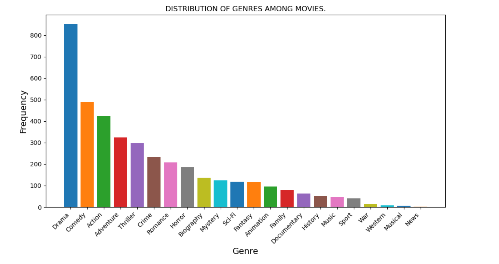
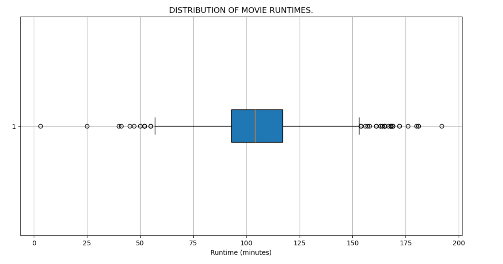
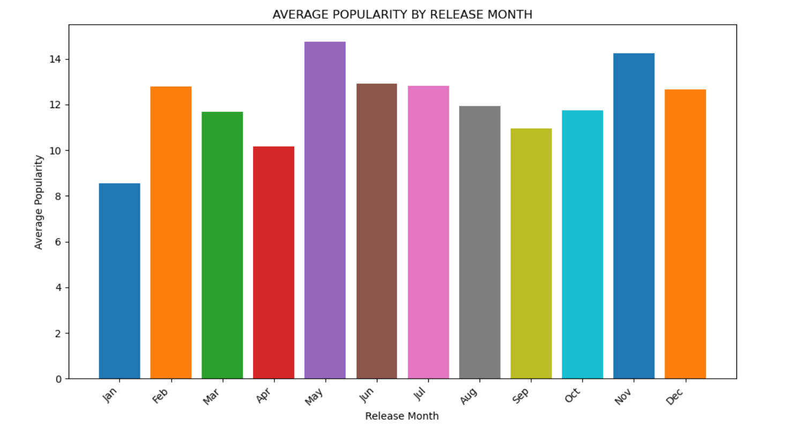
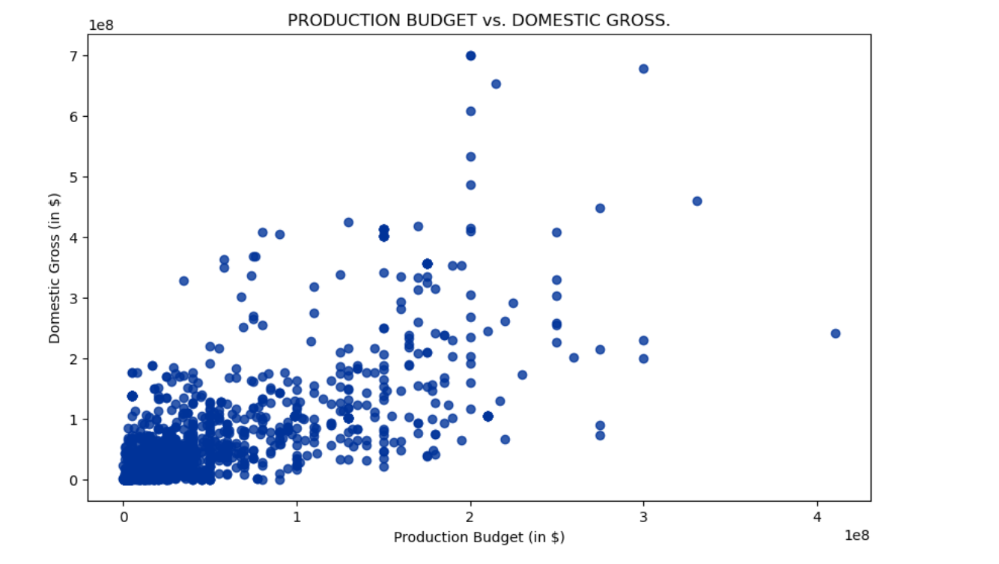
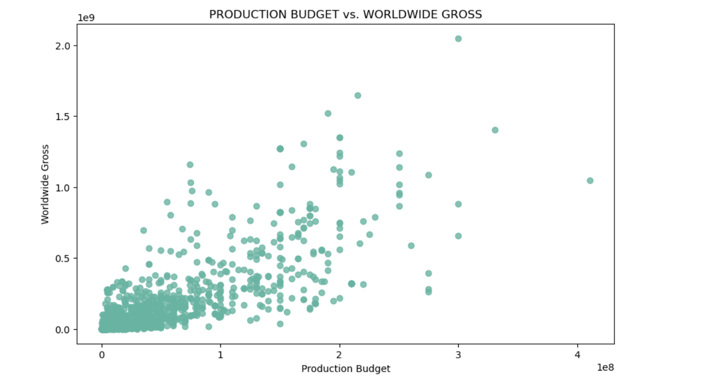

# PHASE 1 PROJECT : Microsoft Film Studios Data Analysis Project.

## Introduction
Welcome to the Microsoft Film Studios Data Analysis project. In this project, we explore various aspects of the film industry using data analysis techniques. Our goal is to provide insights and recommendations to `Microsoft` as they venture into the film production business.

## Business Understanding
Microsoft is looking to establish its presence in the film industry by launching its own film production studio. To ensure success, they need to understand key trends and factors influencing the success of movies in today's market.

## Business Problem
Microsoft wants to understand the following:
- Popular genres and their performance metrics
- Distribution of movie runtimes and audience engagement
- Vote ratings and movie popularity
- Correlation between production budget and gross revenue

## Objectives
- Analyze genre distribution and performance metrics.
- Investigate the distribution of movie runtimes and their impact on audience engagement.
- Examine vote ratings and popularity in relation release month.
- Analyze the correlation between production budget and gross revenue.

## Data Understanding
We gathered data from various sources, including Box Office Mojo, IMDb, The Numbers and The Movie Database (TMDb). 
In the folder `zippedData` are movie datasets from:

* [Box Office Mojo](https://www.boxofficemojo.com/)
* [IMDB](https://www.imdb.com/)
* [Rotten Tomatoes](https://www.rottentomatoes.com/)
* [TheMovieDB](https://www.themoviedb.org/)
* [The Numbers](https://www.the-numbers.com/)

## Data Preparation
We performed data cleaning, which involved handling missing values, removing duplicates, and standardizing column formats. Additionally, we merged multiple datasets to create a comprehensive dataset for analysis.

## Exploratory Data Analysis (EDA)
### Genre Analysis
We investigated the distribution of movie genres and their performance metrics using bar charts.

### Runtime Analysis
We explored the distribution of movie runtimes using box plots to understand their impact on audience engagement.

### Vote Ratings and Popularity
We examined the distribution of vote ratings using histogram to gauge audience satisfaction.

### Release Month and Popularity Analysis
We analyzed the relationship between release month and movie popularity using a bar chart to identify potential trends.

### Budget and Gross Revenue Analysis
We investigated the correlation between production budget and domestic gross, as well as worldwide gross, using scatter plots to understand profitability.

## Conclusion.
Based on our analysis, we found that:
As Microsoft's new studios embark on their journey into the film industry, data-driven insights from exploratory analysis provide valuable guidance for strategic decision-making. Here are my key takeaways:

1. **Genre Analysis:** Drama emerges as the most prevalent genre, followed by Comedy and Action. This insight suggests a strong demand for narrative-driven content, with potential opportunities to explore a variety of genres to cater to diverse audience preferences.

2. **Runtime Analysis:** The boxplot analysis reveals a concentration of movie runtimes between 150 and 175 minutes. Understanding audience expectations and preferences regarding movie length can inform content creation strategies and enhance viewer engagement.

3. **Vote Ratings Distribution:** Movies with average vote ratings between 6 and 7 received the highest frequency of votes, indicating a preference for moderately rated films among audiences. This insight underscores the importance of delivering quality content that resonates with viewers.

4. **Average Popularity by Release Month:** May and November emerge as the months associated with the highest average popularity scores for movie releases. Leveraging seasonal trends and release timing can optimize audience engagement and maximize the impact of movie launches.

5. **Correlation Analysis:** Positive correlations between production budget and both domestic gross and worldwide gross highlight the importance of strategic financial investment in movie production. By allocating resources effectively and optimizing budget allocations, Microsoft's studios can enhance the potential for financial success and profitability.

## Recommendations.
1. **Diversify Genre Portfolio:** While Drama remains a dominant genre, explore opportunities to diversify the genre portfolio to appeal to broader audience segments. Experiment with genres such as Comedy, Action, and Adventure while keeping an eye on emerging trends and audience preferences.

2. **Optimize Runtime:** Maintain a balance between movie runtime and audience preferences. Consider the optimal duration for storytelling while ensuring that content remains engaging and immersive. Explore opportunities to experiment with runtime lengths to gauge audience response and adapt accordingly.

3. **Focus on Quality:** Prioritize quality content creation to drive positive audience sentiment and engagement. Invest in storytelling, character development, and production value to elevate the overall viewing experience and differentiate from competitors.

4. **Strategic Release Planning:** Leverage insights on release month popularity to strategically plan movie releases. Align content launches with peak audience engagement periods to maximize visibility, buzz, and box office performance.

5. **Financial Strategy:** Continuously evaluate the return on investment (ROI) of movie productions to inform budget allocation decisions. Balance financial resources between high-budget projects and potential blockbuster opportunities to mitigate risks and optimize profitability.

By implementing these recommendations and leveraging data-driven insights, Microsoft's new studios can navigate the complexities of the film industry landscape with confidence, creativity, and strategic foresight. With a better understanding of audience preferences, genre trends, runtime dynamics, and the impact of production budgets on revenue, Microsoft can make informed decisions at every stage of the filmmaking process. This data-driven approach will not only enhance the quality of their productions but also optimize their marketing strategies, maximize audience engagement, and ultimately drive success in the highly competitive entertainment market.

## Acknowledgments
- Credit to data sources (IMDb, TMDb, Box Office Mojo, TN).
- Plus libraries and frameworks used (e.g. Numpy, Pandas, Matplotlib, Seaborn).
